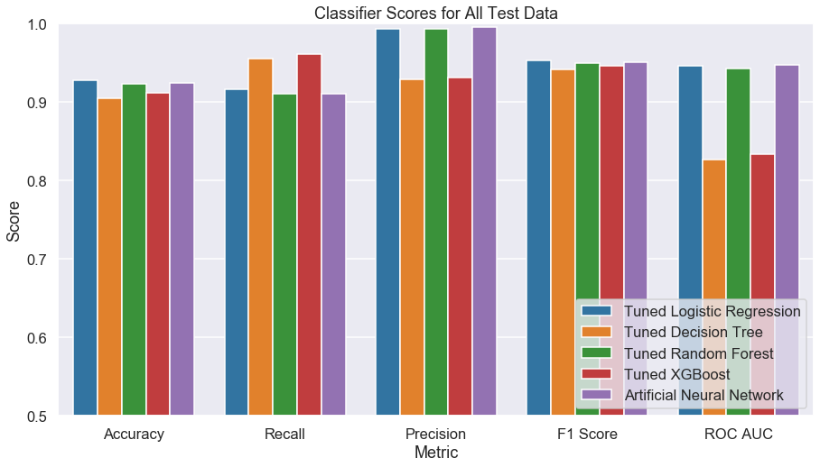
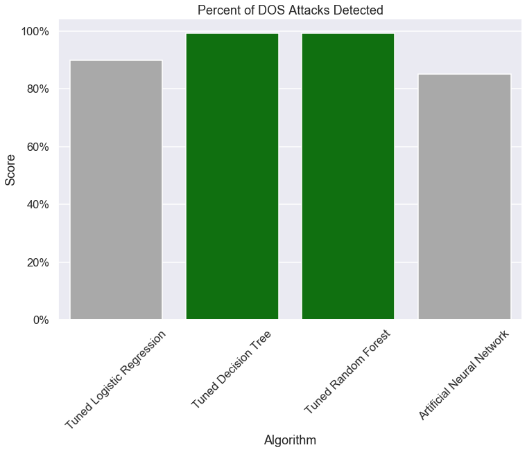
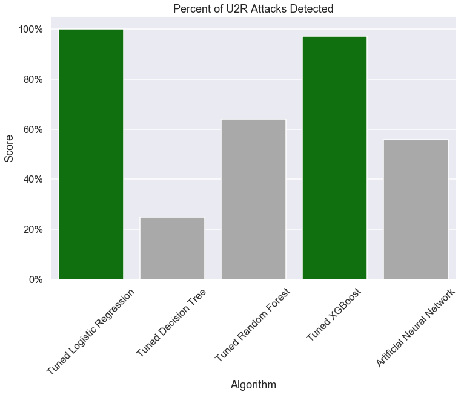
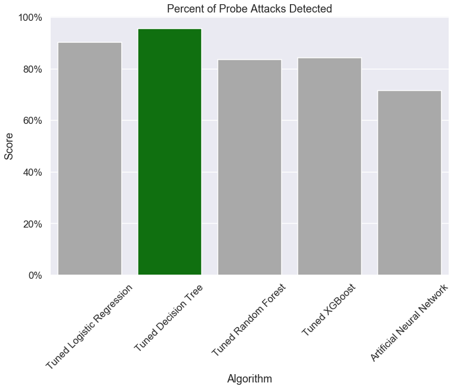
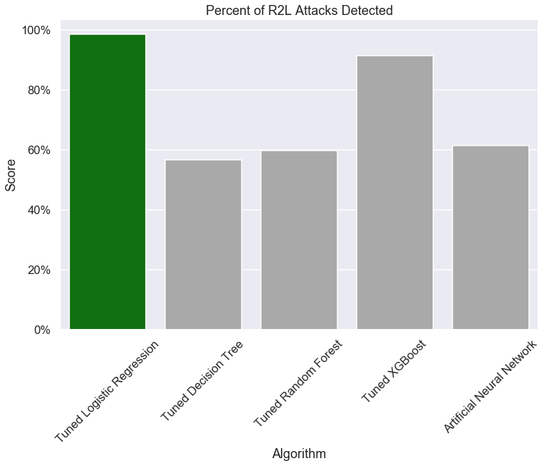

# Network Intrusion Detection System

## Table of Contents
* [General Info](#general-info)
* [Technologies](#technologies)
* [Final Models' Results](#final-models'-results)
* [Security Recommendations](#security-recommendations)
* [Further Studies](#further-studies)

## General Info
Network security is a very serious matter in modern times. In fact, statistics show that at least 64% of companies have experienced web-based attacks. The average data breach cost is expected to exceed 150 billion USD in 2020 and most companies will take around six months to even realize that they've been hacked. While small businesses may think their safe they are actually the target around 43% of the time.

An intrusion detection system (ISD) is a software application which monitors incoming network traffic for malicious activity. The goal of this project was to create a network intrusion detection system capable of thwarting future attacks.

The dataset used to build the ISD comes from the 1998 DARPA Intrusion Detection Evaluation Program prepared and managed by MIT Lincoln Labs. The data included a wide variety of intrusions along with normal connections simulated in a military network environment.Out dataset had four broad categories of threats.

* Denial of Service (DoS) - a DoS attack is an attack in which the perpetrator floods a machine or network with requests to the point where legitimate requests are unable to be processed.
* User-to-root (U2R) - a U2R attack is an attack in which the perpetrator uses a legitimate user account (guessed password) and uses a vulnerability to gain root access.
* Probe - a probe is an attack in which the perpetrator seeks to gain information about a network of computers with the sole purpose of finding security vulnerabilities.
* Remote-to-local (R2L) - a R2L attack occurs when the perpetrator has the ability to send packets to a machine over a network (but without an account on that machine) exploits a vulerability to gain user access to that machine.

What makes this dataset more interesting is that the test dataset contains several different attacks which were not seen in the training data. This could potentially show which classification algorithms may be better generalized to new attacks. "Some intrusion experts believe that most novel attacks are variants of known attacks and the "signature" of known attacks can be sufficient to catch novel variants." The training dataset contains a total of 24 training attack types, with an additional fourteen types in the test data only.

At this point we will note that twenty years later this dataset is outdated and does not accurately represent modern day network traffic or threats. Nevertheless, it is still the largest fully-labelled intrusion dataset available and is a good exercise for machine learning and cybersercurity enthusiasts alike. 

## Technologies
This project was created using the following languages and libraries. An environment with the correct versions of the following libraries will allow re-production and improvement on this project. 

* Python version: 3.6.9
* Matplotlib version: 3.0.3
* Seaborn version: 0.9.0
* Pandas version: 0.24.2
* Numpy version: 1.16.2
* Sklearn version: 0.20.3
* XGBoost version: 0.90
* TensorFlow version: 1.14.0
* Keras version: 2.3.0

## Final Models' Results

### Entire Test Set

### DOS Attacks

### U2R Attacks

### Probe Attacks

### R2L Attacks

## Security Recommendations

### Employ Stacked Model Approach
Based on the differing performance of the models detecting various categories of attack I would recommend a stack model approach for the final ISD. For example, logistic regression and XGBoost did a great job of classifying U2R attacks, losistic regression did a great job detecting R2L attacks, and the random forest classifier did a great job detecting DOS attacks. No model did excellent (+99% detection) at detecting probe attacks so further research is necessary. 

### Gather More Data on Probe Attacks
We were only able to train our models on 4,107 probe attacks so it would be high beneficial to our models to be able to to see more of these types of attacks so they may better classify them. 

## Further Studies
As with all data science projects there is always more work to do. Most notably I've been considering the following. 

### Stricter Feature Selection
Stricter feature selection would most likely allow us to train more accurate models. Because my domain knowledge in network sercurity is limited it would be difficult for me to use that for feature selection. However, other methods such as Principal Component Analysis (PCA) and correlation coefficient cutoffs could be used to determine salient features. 

### Address Attack Type Imbalance
Out of all of our training data (494k connections) around 79% of it was DOS attacks, 19.7% were normal connections, 0.83% were probe attacks, 0.43% were R2L attacks, and 0.01% were U2R attacks. This dataset was very imbalanced from this perspective and techniques for such datasets (i.e. SMOTE) could be utilized to create a more even dataset. Furthermore, models could be individually trained to detect specific categories of attack. 

### Finer Tune Hyperparameters
Due to the timeframe and scale of this project there was limited time to spend tuning these models. This is especially true of the XGBoost and artificial neural network algorithms which are computationally intensive algorithms to train and have a large quantity of hyperparameters. Given more time I would like to spend more time tuning these models specifically. 

### Test Unsupervised Anomaly Detection Algorithms 
Finally, I'd be interested in taking an unsupervised learning approach to detecting these intrusions. Specifically Isolation Forest and Local Outlier Factor are of personal interest and I believe could be good candiates for this job. 

